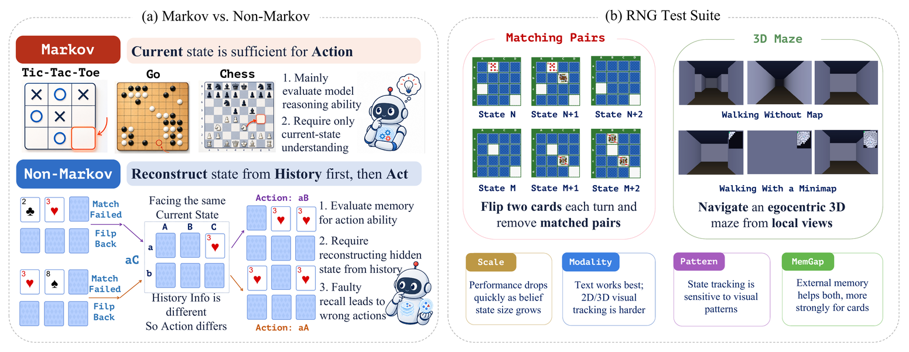

<h1 align="center">Beyond the Current Observation: Evaluating Multimodal Language Models in Non-Markov Games</h1>

<p align="center"><strong>RNG-Bench · Reconstructive Non-Markov Games</strong></p>

<p align="center">
  <a href="https://github.com/SYuan03">Shengyuan Ding</a><sup>1,2,3,*</sup> &nbsp;·&nbsp;
  <a href="https://scholar.google.com/citations?user=zxtbqQwAAAAJ">Xilin Wei</a><sup>1,*</sup> &nbsp;·&nbsp;
  <a href="https://github.com/FangXinyu-0913">Xinyu Fang</a><sup>4,*</sup> &nbsp;·&nbsp;
  <a href="https://github.com/kennymckormick">Haodong Duan</a><sup>5,†</sup>
  <br>
  <a href="https://scholar.google.com/citations?user=GMzzRRUAAAAJ">Dahua Lin</a><sup>3,5</sup> &nbsp;·&nbsp;
  <a href="https://github.com/myownskyW7">Jiaqi Wang</a><sup>2,†</sup> &nbsp;·&nbsp;
  <a href="https://github.com/yuhangzang">Yuhang Zang</a><sup>3,†</sup>
</p>

<p align="center">
  <sup>1</sup>Fudan University &nbsp; <sup>2</sup>Shanghai Innovation Institute &nbsp; <sup>3</sup>Shanghai AI Laboratory
  <br><sup>4</sup>Zhejiang University &nbsp; <sup>5</sup>The Chinese University of Hong Kong
  <br><sub><sup>*</sup>Equal contribution &nbsp; <sup>†</sup>Corresponding authors</sub>
</p>

<p align="center">
  <a href="https://arxiv.org/abs/2606.19338"></a>
  <a href="https://internlm.github.io/RNGBench/"></a>
  <a href="#"></a>
  <a href="#"></a>
  <a href="LICENSE"></a>
</p>

<div align="center">
  
</div>

Many real decisions hinge on something **no longer on screen** — a card seen a few
turns ago, a corridor already walked. We call this the **Non-Markov** regime: the
current observation is not a sufficient statistic, so a model must reconstruct the
relevant hidden state from its history *before* it acts, and a single recall error
changes what it sees next. **RNG-Bench** isolates this **remember-to-act** ability
in closed loop, under controlled difficulty, with two complementary games.

### Two complementary games

- 🎴 **Matching Pairs** — *static, categorical* hidden state. Card identities are
  revealed for a single turn and must later be recalled by location.
- 🧭 **3D Maze** — *dynamic, spatial* hidden state. Egocentric first-person views
  must be assembled into a map to reach the goal.

Both run under one harness and one strict parser, so a score drop reflects
belief-state tracking rather than rule misunderstanding or action formatting.

### Highlights

- **Remember-to-act, in closed loop.** The model acts every turn on observations
  that have since disappeared, and a recall error reshapes the next observation —
  unlike memory benchmarks that ask a single post-hoc question.
- **Controlled difficulty.** Independently vary hidden-state scale (grid / map
  size), visual pattern, and observation modality (text vs. image), with
  everything else held fixed.
- **Duel protocol.** Two models alternate on the same board, cancelling instance
  variance and rewarding exploitation of opponent-revealed cards.
- **Long-context stress test.** The hardest configurations reach ~128K tokens and
  ~350 image inputs per episode, and scale further with size.
- **Far from saturation.** The best 10×10 image Matching Pairs score is 62.3%
  (GPT-5.4); the best 13×13 maze success rate is 50% (Gemini-3.1-Pro).

---

## What's in this repo

```
.
├── model_presets.py         # Single shared model registry (both games)
├── framework/               # Shared eval harness: LLM client, runner, game, types
├── 1_matching_pairs_new/    # Matching Pairs environment + eval runner (see its README)
│   ├── env/                 # Game logic, board rendering (text / image themes)
│   ├── modes/               # single_normal / single_noaction / dual_normal / dual_noaction
│   ├── scripts/             # Example sweep launchers
│   └── assets/              # Card themes: poker, noise, textures, perlin, ...
├── 2_3d_maze/               # 3D Maze environment + eval runner (see its README)
│   ├── game.py              # DFS maze gen + raycast renderer
│   ├── runner.py            # Episode loop (binds to framework LLM client)
│   ├── run.py               # CLI
│   └── scripts/             # Example eval launcher
├── docs/                    # Project homepage (GitHub Pages)
├── .env.example             # Copy to .env; API keys / endpoints
└── requirements.txt
```

Both games share one model registry (`model_presets.py`) and one eval harness
(`framework/`); adding a model in either takes effect everywhere. The
data-generation engine used for the training experiments below is not part of
this release yet.

---

## Quick Start

### Install

```bash
git clone https://github.com/InternLM/RNGBench.git
cd RNGBench
conda create -n rngbench python=3.10 -y && conda activate rngbench
pip install -r requirements.txt   # openai httpx pillow numpy python-dotenv + pandas/seaborn/matplotlib (visualize)
```

### Configure an OpenAI-compatible endpoint

Both games read API keys/endpoints from a single repo-root `.env` (loaded
automatically by every entry point). Copy the template and fill in what you use:

```bash
cp .env.example .env
```

| Env var | Used by |
|---|---|
| `OPENAI_API_BASE` / `OPENAI_API_KEY` | Default OpenAI-compatible endpoint — OpenAI, or a self-hosted vLLM / lmdeploy / Ollama server (the Qwen / Kimi / `gpt-5.4` presets). |
| `GEMINI_API_KEY` | Google Gemini native API (the `gemini-3.1-pro` presets). |
| `ARK_API_KEY` | Volcengine Ark / Doubao Seed (the `seed-2.0` presets). |
| `NON_MARKOV_SAMPLE_SEED` | Optional reproducible sampler seed (presets opt in via `sample_seed_env`). |

A model preset only needs whichever key its endpoint uses — you do **not** need
all of them. The endpoints in `model_presets.py` are illustrative placeholders
(`localhost` / example hosts); point them at your own deployment.

### Add or change a model

All models live in the repo-root **`model_presets.py`**, shared by both games. A
preset maps a short name → endpoint + sampling. The minimal form points at your
default `.env` endpoint:

```python
MODEL_PRESETS = {
    "my-model": {
        "model": "served-model-name",          # name your server exposes
        "api_base": "http://localhost:8000/v1", # or omit to use OPENAI_API_BASE
        "api_key_env": "OPENAI_API_KEY",        # env var holding the key
        "extra_params": {"temperature": 0.8, "max_tokens": 32768},
    },
}
```

Then pass `--model my-model` to any mode. See the existing entries for vLLM/
lmdeploy, Ark, and gateway examples.

### Run Matching Pairs

```bash
cd 1_matching_pairs_new

# Single-player, image board, 8×10 grid, noise pattern
python -m modes.single_normal \
  --model gpt-5.4 \
  --grid 8x10 --render image --theme noise \
  --seed 0 --max-resp-per-pair 5 \
  --out results_demo

# Duel: two models alternate on the same board
python -m modes.dual_normal \
  --model-a gpt-5.4 --model-b gemini-3.1-pro \
  --grid 8x10 --render-a image --render-b image --theme poker \
  --seed 0 --out results_demo

# Text mode (no images)
python -m modes.single_normal \
  --model gpt-5.4 --grid 8x10 --render text \
  --seed 0 --out results_demo
```

Each run writes `game.json` (trajectory) and `images/round_*.png` (per-round renders) under `results_demo/<mode>/<model>/<theme>/<grid>/seed_<S>/`.

### Run 3D Maze

```bash
cd 2_3d_maze

# 11×11 maze, 3D first-person view
python run.py --model gpt-5.4 --maze-size 11 --seed 0

# Sweep five seeds
python run.py --model gpt-5.4 --seeds 0,1,2,3,4 --maze-size 13

# Preview without calling any LLM
python run.py --model dummy --preview --seed 0 --maze-size 11

# Memory Gap: --minimap shows the true map every step (oracle); the score drop
# vs. the normal run isolates spatial recall from perception / decision-making.
python run.py --model gpt-5.4 --maze-size 13 --seed 0 --minimap
```

---

## Main Results

No frontier system is close to saturation.

**Single-player.** Two separate tables, one per game. Best per column in **bold**.

*Matching Pairs* (10×10, image, noise theme) — `Score%` = fraction of matched pairs; `Resp./Score` = responses per matched pair; `PF`/`IA` = parse-failure / invalid-action rates.

| Model | PF%↓ | IA%↓ | Resp./Score↓ | Score%↑ |
|---|---:|---:|---:|---:|
| GPT-5.4 | **0.0** | 4.3 | **8.01** | **62.3** |
| Gemini-3.1-Pro | 0.4 | **2.5** | 10.00 | 50.0 |
| Seed-2.0-Lite | 1.2 | 4.3 | 11.57 | 43.2 |
| Kimi-K2.5 | 1.8 | 2.8 | 13.16 | 38.0 |
| Qwen3.5-397B | **0.0** | 3.0 | 19.74 | 25.3 |

*3D Maze* (13×13, no minimap, mean optimal path 60 steps) — `GS%` = aggregate score (success rate, efficiency, exploration); `Eff.` is over successful episodes only.

| Model | SR%↑ | Explore%↑ | Walls↓ | Eff.%↑ | GS%↑ |
|---|---:|---:|---:|---:|---:|
| GPT-5.4 | 20.0 | 32.3 | 3.2 | **75.7** | 30.5 |
| Gemini-3.1-Pro | **50.0** | **36.4** | **0.1** | 62.5 | **49.7** |
| Seed-2.0-Lite | 20.0 | 19.4 | 16.6 | 38.9 | 21.7 |
| Kimi-K2.5 | 10.0 | 17.9 | 7.1 | 61.1 | 16.1 |
| Qwen3.5-397B | 0.0 | 21.0 | 9.9 | 0.0 | 10.5 |

**Duel** — Matching Pairs, image (poker), each model plays 16 games vs. the other four (both player orders, two seeds). The ranking **diverges** from single-player: Gemini-3.1-Pro wins *every* matchup, exploiting cards revealed by the opponent.

| Model | Win%↑ | W | T | L | Score%↑ | ELO↑ |
|---|---:|--:|--:|--:|---:|---:|
| Gemini-3.1-Pro | **100.0** | 16 | 0 | 0 | **36.5** | **1803** |
| GPT-5.4        | 50.0 | 7 | 2 | 7 | 25.3 | 1492 |
| Qwen3.5-397B   | 46.7 | 7 | 1 | 8 | 18.0 | 1476 |
| Kimi-K2.5      | 37.5 | 5 | 2 | 9 | 18.0 | 1423 |
| Seed-2.0-Lite  | 15.6 | 2 | 1 | 13 | 12.3 | 1306 |

**Key findings.** Performance drops sharply with scale (Qwen3.5-397B: 90.6% → 0.7% from 4×4 to 12×12). Vision is the bottleneck, not history length — Qwen3.5-397B and Kimi-K2.5 solve Matching Pairs perfectly in text but fall to 38.3% / 43.3% under noise-pattern images. The textual action trace is load-bearing — removing it collapses GPT-5.4 from 62.3% to 15.3% even though every flip is visible in the board image. And there is large headroom: an optimal policy needs only **3.24** responses per matched pair vs. 8.01 for the best model. Full ablations are in the paper.

---

## Sweeps

Each game ships example launchers under its `scripts/` directory. They build a
model × config × seed matrix and run it in parallel; everything is overridable
via env vars, and `PARALLEL` (a thin wrapper over `xargs -P`) is the concurrency
knob — set it to whatever your API rate limit allows.

```bash
# Matching Pairs — see 1_matching_pairs_new/scripts/
MODELS="gpt-5.4 gemini-3.1-pro" GRIDS="8x10 10x10" PARALLEL=4 \
  bash 1_matching_pairs_new/scripts/run_eval.sh        # single-player matrix
MODEL_A=gpt-5.4 MODEL_B=gemini-3.1-pro SEEDS="0 1 2 3" \
  bash 1_matching_pairs_new/scripts/run_duel.sh        # duel protocol

# 3D Maze — see 2_3d_maze/scripts/
MODELS="gpt-5.4 gemini-3.1-pro" SIZES="9 11 13" SEEDS="0 1 2 3 4" PARALLEL=4 \
  bash 2_3d_maze/scripts/run_eval.sh
```

See each game's `README.md` for the full flag reference.

---

## Citation

```bibtex
@article{rngbench2026,
  title   = {Beyond the Current Observation: Evaluating Multimodal Language Models in Non-Markov Games},
  author  = {Ding, Shengyuan and Wei, Xilin and Fang, Xinyu and Duan, Haodong and
             Lin, Dahua and Wang, Jiaqi and Zang, Yuhang},
  journal = {arXiv preprint arXiv:2606.19338},
  year    = {2026},
}
```

---

## License

Code is released under the MIT License (see `LICENSE`). The card-asset themes under `1_matching_pairs_new/assets/` retain their original licenses (see `assets/<theme>/LICENSE` where applicable).

## Acknowledgements

We thank the maintainers of [LLaMA-Factory](https://github.com/hiyouga/LLaMA-Factory), [vLLM](https://github.com/vllm-project/vllm), and the open-weight model teams whose checkpoints we evaluated.
